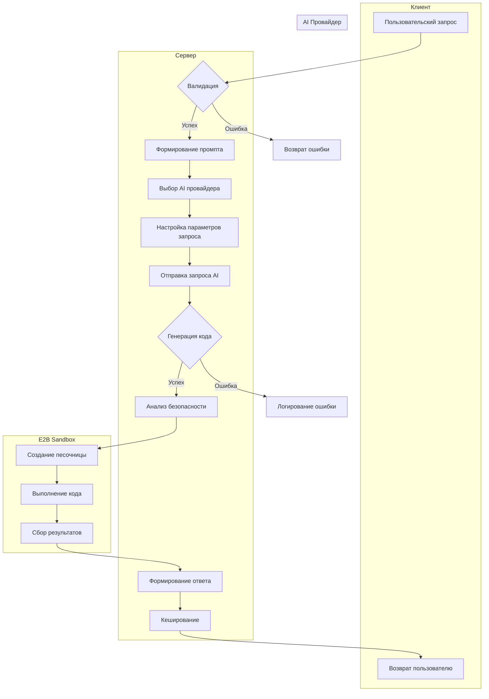

# Описание проекта

Этот проект представляет собой веб-приложение, которое использует AI для генерации кода. Он позволяет пользователям отправлять запросы, а затем использует AI для создания фрагментов кода, которые выполняются в безопасной изолированной среде (песочнице).

## Детализированное описание архитектуры

### Клиентская часть (Frontend)
- Построена на Next.js 14 с использованием App Router
- Использует shadcn/ui для компонентов интерфейса
- Реализует:
  * Форму ввода пользовательских запросов
  * Отображение сгенерированного кода
  * Визуализацию результатов выполнения
  * Историю запросов

### Серверная часть (Backend)
- API на основе Next.js Route Handlers
- Основные модули:
  * Обработка запросов к AI провайдерам
  * Управление шаблонами промптов
  * Интеграция с E2B Sandbox
  * Кеширование результатов

### Интеграция с AI провайдерами
Поддерживаются:
- OpenAI (GPT-4, GPT-3.5)
- Anthropic (Claude)
- Google AI (Gemini)

Каждый провайдер имеет:
- Специфичные параметры запроса
- Обработку ошибок
- Лимиты и квоты

## Архитектура проекта

Проект построен на основе Next.js 14 и использует следующие основные компоненты:

*   `app/`: Next.js роуты.
*   `components/`: UI компоненты (shadcn/ui).
*   `lib/`: Бизнес-логика и утилиты.
*   `sandbox-templates/`: Шаблоны для E2B песочниц.

## Детализированный процесс обработки запроса

### 1. Инициирование запроса
- Пользователь вводит запрос через UI
- UI валидирует и нормализует ввод
- Формируется объект сообщения с метаданными

### 2. Обработка на сервере
- API endpoint получает запрос
- Извлекаются параметры:
  * Выбранная модель AI
  * Шаблон промпта
  * Конфигурация выполнения
- Формируется системный промпт с учетом:
  * Безопасности выполнения
  * Ограничений песочницы
  * Специфики задачи

### 3. Взаимодействие с AI провайдером
- Создается клиент для выбранного провайдера
- Настраиваются параметры:
  * Температура
  * Максимальная длина токенов
  * Стоп-последовательности
- Отправляется запрос с:
  * Системным промптом
  * История диалога (если есть)
  * Контекстом выполнения

### 4. Генерация и выполнение кода
- AI возвращает сгенерированный код
- Код анализируется на:
  * Безопасность
  * Соответствие шаблону
  * Наличие запрещенных операций
- Создается песочница E2B с:
  * Предустановленными зависимостями
  * Ограниченными ресурсами
  * Изолированной файловой системой
- Код выполняется с таймаутом
- Захватываются:
  * stdout/stderr
  * Возвращаемое значение
  * Метрики выполнения

### 5. Возврат результатов
- Формируется структурированный ответ:
  * Сгенерированный код
  * Результаты выполнения
  * Логи выполнения
  * Ошибки (если есть)
- Данные кешируются
- Ответ отправляется клиенту

*   `app/api/chat/route.ts`: API endpoint для обработки запросов к ИИ.
*   `lib/models.ts`: Файл, содержащий функцию `getModelClient` для создания клиентов для работы с AI провайдерами.
*   `lib/prompt.ts`: Файл, содержащий функцию `toPrompt` для формирования системного промпта.
*   `lib/templates.ts`: Файл, содержащий информацию о доступных шаблонах.
*   `integration_description.md`: Файл, содержащий подробное описание интеграции с AI провайдерами.
*   `project_description.md`: Этот файл, содержащий описание работы проекта, диаграммы и флоучарты.

## Описание шаблонов

1. **code-interpreter-v1**:
   - **Описание**: Шаблон для анализа данных на Python. Использует Jupyter notebook для выполнения кода с акцентом на анализ данных и визуализацию.
   - **Файл**: script.py
   - **Инструкции**: Выполняет код как ячейку Jupyter notebook. Сильный акцент на анализ данных. Может использовать сложные визуализации для объяснения результатов.

2. **nextjs-developer**:
   - **Описание**: Шаблон для разработки приложений на Next.js 13+. Использует pages router и автоматически перезагружает изменения.
   - **Файл**: pages/index.tsx
   - **Инструкции**: Приложение Next.js 13+, которое автоматически перезагружается. Использует pages router.

3. **vue-developer**:
   - **Описание**: Шаблон для разработки приложений на Vue.js 3+. Автоматически перезагружает изменения.
   - **Файл**: app.vue
   - **Инструкции**: Приложение Vue.js 3+, которое автоматически перезагружается. Только при явном запросе на создание Vue приложения.

4. **streamlit-developer**:
   - **Описание**: Шаблон для создания приложений на Streamlit. Автоматически перезагружает изменения.
   - **Файл**: app.py
   - **Инструкции**: Приложение Streamlit, которое автоматически перезагружается.

5. **gradio-developer**:
   - **Описание**: Шаблон для создания приложений на Gradio. Интерфейс Gradio Blocks/Interface должен называться demo.
   - **Файл**: app.py
   - **Инструкции**: Приложение Gradio. Gradio Blocks/Interface должен называться demo.
